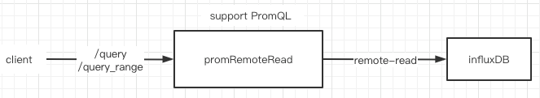

promRemoteRead can make TSDB support PromQL using remote-read protocol.

### arch



### use

```
# ./promRemoteRead --config.file=config.yaml --listen-address=0.0.0.0:12345
```

### demo

query instant:
```
# curl 'http://localhost:12345/api/v1/query?query=sum(up)'
```

query range:
```
# curl 'http://localhost:12345/api/v1/query_range?query=sum%20by%20(instance)%20(rate(node_cpu_seconds_total%5B5m%5D))&start=1648973218.698&end=1648976818.698&step=14&_=1648698721638'
```
